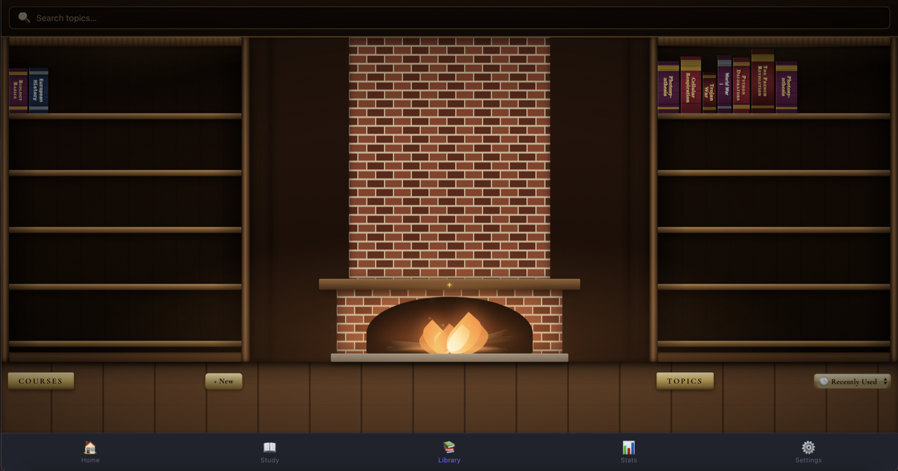

# AI Tutor

A local-first study app: turn your own notes, lecture slides, or a URL into
explanations, flashcards, and quizzes — with an antique-library-themed shelf
of everything you've studied. Runs entirely on your own machine, using your
own Anthropic API key.



## Features

- **Three study modes per topic** — structured Explanations (streamed,
  markdown-rendered), 3D-flip Flashcards, and multiple-choice Quizzes with a
  pausable on-screen timer
- **Bring your own material** — paste text, scrape a URL, search the web
  (with your own Tavily / Brave / Serper key), or upload a PDF / Word /
  PowerPoint file; structure (headings, tables, slide titles) is recovered
  directly instead of flattened into a blob. When you'd rather Claude find
  its own sources — a "Use AI" topic with no material at all — it can
  search the web itself via Anthropic's native web search tool, no extra
  key needed
- **Hybrid local + AI question generation** — a local, zero-API-call
  pattern-extraction pass covers the easy definitional tier; a small AI call
  tops it up with synthesis-style questions the local pass can't produce.
  Choose "With AI" / "Both" / "Without AI" per topic
- **Multiple simultaneous study tabs** — the same topic or several different
  ones, open side by side, each with its own progress
- **Courses** — group topics into an ordered syllabus with prerequisites and
  per-topic status, plus a generated study guide across the whole course
- **Stats** — accuracy trends over time, streaks, and a session history,
  per topic or overall
- **Installable PWA** with offline shell caching
- **Fully themeable** — accent color, background, font, and text size, all
  persisted locally

## Architecture

This is deliberately **local-first, not multi-tenant**: one person, one
running instance, one `tutor.db` file, one API key that only that person
pays for. There's no login system because there's nothing to log into — the
app *is* your account. See [`AI_Tutor_Roadmap.docx`](./AI_Tutor_Roadmap.docx)
in this repo for the full reasoning and the multi-device plan.

**Stack:** Node.js + Express, better-sqlite3 (with an automatic pure-JS
`sql.js` fallback if the native module can't build on your machine),
vanilla JS on the frontend (no framework, no bundler — see
[`public/js/`](./public/js)), the Anthropic Messages API for generation.

## Quick start

Requires **Node 20+**.

```bash
git clone <this-repo-url>
cd tutor
npm install
npm start
```

> Don't want to deal with git and npm by hand? [`install.sh`](./install.sh) does
> the clone (or update, if already installed) and `npm install` for you:
> `curl -fsSL <raw-install.sh-url> | bash`. Re-run it any time to pull the
> latest release.

Open `http://localhost:3001`, then add your [Anthropic API key](https://console.anthropic.com/settings/keys)
under **Settings → AI Provider** (needs billing configured on your Anthropic
account — you're paying for your own usage directly, there's no markup and
no middleman). The app works before that too — local-only question
generation ("Without AI") needs no API access at all.

> Prefer an environment variable instead? `cp .env.example .env`, paste your
> key in, and start the app — it takes precedence over whatever's saved in
> Settings. That's the dev/CI-friendly path; pasting into Settings is the
> one anyone else can actually use.

> First install compiles `better-sqlite3`, a native module — this needs a
> C++ toolchain (Xcode Command Line Tools on macOS, `build-essential` on
> Linux, or the "Desktop development with C++" workload on Windows). If it
> fails, the app still runs — it automatically falls back to the pure-JS
> `sql.js` engine, just slower per write. Rerun `npm rebuild better-sqlite3`
> once your toolchain is set up to get native performance back.

## Scripts

| Command | Does |
|---|---|
| `npm start` | Run the server |
| `npm run dev` | Run with auto-restart on file change |
| `npm test` | Run the test suite (119 tests) |
| `npm run lint` | ESLint |
| `npm run format:check` | Check formatting without changing anything |
| `npm run format` | Apply Prettier formatting |

## Privacy

Your notes and any material you upload are sent to Anthropic's API (under
your own key) to generate explanations and questions. Everything else —
your topics, progress, stats, and settings — lives only in `db/tutor.db` on
your own machine and is never sent anywhere else. Nothing is collected,
logged, or shared by this project itself.

## License

[MIT](./LICENSE)
